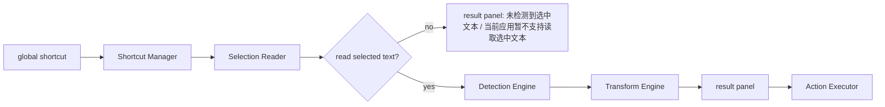
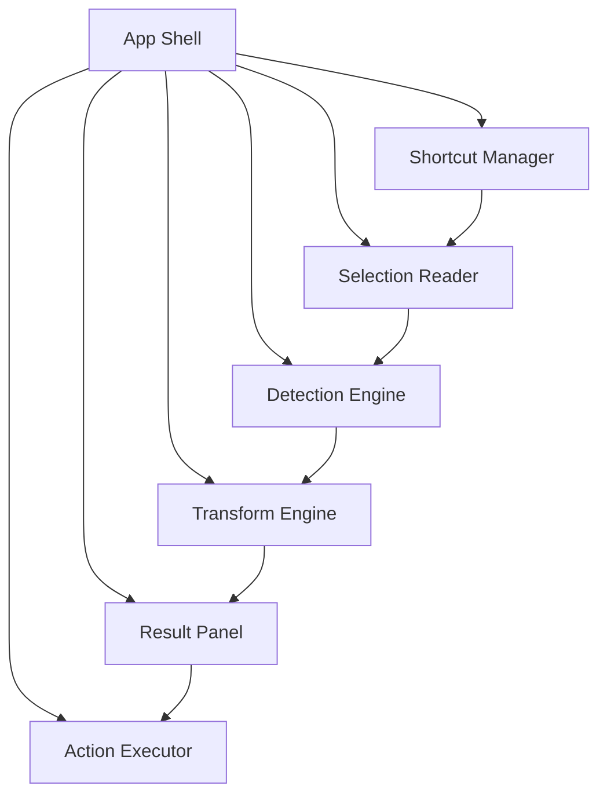
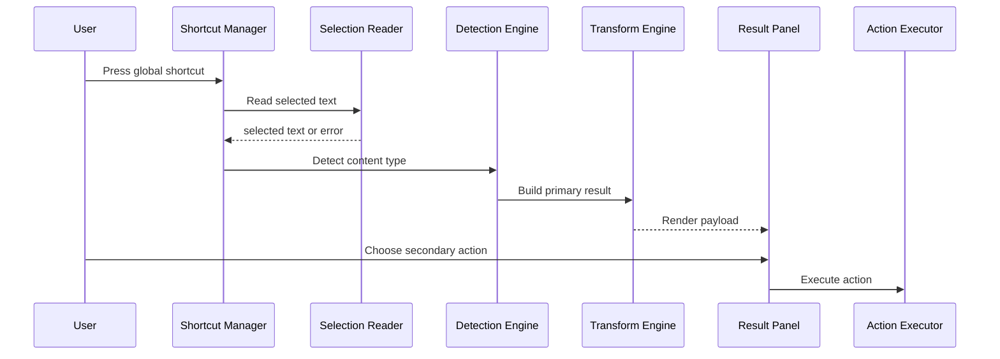

# Mac Text Actions 技术架构

## 1. 架构目标
- 将输入获取、识别、转换、动作执行和界面渲染解耦
- 让新增文本类型只影响识别与转换层，而不破坏主流程
- 在保留平台适配空间的前提下，保持架构足够具体

## 2. 技术选型
### 2.1 开发语言
- 使用 `Swift 6` 作为首版唯一开发语言
- 所有系统集成、窗口控制、业务逻辑和 UI 都以原生 Swift 实现

### 2.2 UI 框架
- 使用 `SwiftUI` 作为主要 UI 层
- 使用 `AppKit` 作为系统桥接层

### 2.3 选型原则
- 该项目是 macOS 单平台工具，不以跨平台为目标
- 主要复杂度来自系统集成，而不是 Web 视图渲染
- 因此不采用 `Tauri`、`Electron` 或其他 Web 容器路线

### 2.4 第三方依赖策略
- 优先使用系统框架：
  - `SwiftUI`
  - `AppKit`
  - `Foundation`
  - `EventKit`
- 若全局快捷键实现成本过高，可引入单一、轻量、成熟的 Swift 库
- 避免在 `v1` 阶段引入与产品价值无直接关系的多余依赖

## 3. 兼容性基线
### 3.1 支持的系统版本
- `v1` 最低支持版本定为 `macOS 13 Ventura`
- 推荐运行环境为 `macOS 14+`
- 若后续验证 `macOS 15` 上有更稳定的系统行为，可将推荐环境提升到 `macOS 15+`，但 `v1` 规划阶段不要求只支持最新系统

### 3.2 选择该基线的原因
- `SwiftUI`、窗口材质、状态管理和系统集成在较新的 macOS 版本上更稳定
- `global shortcut`、浮层窗口和系统桥接能力在较新系统上调试成本更低
- 将最低版本下探到 `macOS 13` 仍然可控，但必须接受更高的兼容性验证成本
- `macOS 14+` 仍然是推荐运行环境，因为系统行为和调试体验更稳定

### 3.3 硬件兼容性
- 首版目标为通用 macOS 桌面环境
- 默认应支持 `Apple Silicon`
- 若构建链路允许，建议产出 `Universal` 应用包以兼容 `Intel Mac`
- 如果后续实际实现依赖仅在 `Apple Silicon` 上验证的能力，需要在发布文档中单独声明

### 3.4 开发环境建议
- `Xcode 16+`
- `Swift 6`
- 使用原生 macOS App 工程结构

### 3.5 系统权限与能力依赖
- `selected text` 读取和 `Replace Selection` 可能依赖辅助功能相关权限
- 提醒事项创建依赖系统提醒事项授权
- 文档和实现都应把权限状态作为显式可见信息，而不是隐式失败

### 3.6 macOS 13 重点验证项
- `global shortcut` 注册和触发稳定性
- 浮层窗口的显示层级、焦点切换和关闭行为
- `selected text` 读取链路
- `Replace Selection` 在不同前台应用下的回写行为
- 材质背景、窗口样式和 `SwiftUI + AppKit` 桥接细节

## 4. 核心模块
### 4.1 App Shell
负责应用生命周期、菜单栏入口、设置页、权限状态和模块装配。

### 4.2 Shortcut Manager
负责注册并监听 `global shortcut`，在用户触发时向主流程派发事件。

### 4.3 Selection Reader
负责读取当前前台应用的 `selected text`，并返回成功结果或明确错误原因。

### 4.4 Detection Engine
负责根据固定优先级识别输入类型。识别优先级详见 [设计文档](../design/mac-text-actions-design.md) 第 3 节。

### 4.5 Transform Engine
负责生成 `primary result` 和类型相关的 `secondary action` 输出。

### 4.6 Action Executor
负责执行副作用动作，包括：
- `Copy Result`
- `Replace Selection`
- `JSON Compress`
- `MD5`
- `Create Reminder`

### 4.7 Result Panel
负责渲染结果、错误、原文摘要和动作入口，并把用户操作回传给 `Action Executor`。

## 5. 平台职责划分
- `SwiftUI` 负责：
  - 设置页
  - 菜单栏配置视图
  - `result panel` 的内容结构和状态渲染
- `AppKit` 负责：
  - `global shortcut` 注册与监听
  - 浮层窗口与显示行为控制
  - 焦点管理与前台应用桥接
  - `selected text` 读取
  - `Replace Selection` 的系统级写回动作
- 领域逻辑保持独立，不依赖具体 UI 组件

## 6. 运行时数据流


## 7. 模块关系


## 8. 架构模式
- 采用 `MVVM + Services`
- `ViewModel` 负责：
  - 面板状态
  - 用户动作路由
  - 错误状态映射
- `Services` 负责：
  - 快捷键、选区读取、提醒事项等系统集成
  - 文本识别和转换
- 不在 `v1` 阶段引入更重的分层模式，避免增加无必要复杂度

## 9. 数据契约建议
### 9.1 SelectionPayload
```text
rawText: String
sourceApp: String?
capturedAt: Date
```

### 9.2 DetectionResult
```text
type: json | invalidJson | timestamp | dateString | plainText
normalizedInput: String
errorMessage: String?
```

### 9.3 TransformResult
```text
primaryOutput: String?
secondaryActions: [ActionType]
displayMode: code | text | error | actionsOnly
errorMessage: String?
```

### 9.4 ActionType
```text
copyResult
replaceSelection
compressJson
generateMd5
createReminder
```

## 10. 分层建议
- 表现层：`result panel`、设置页、菜单栏
- 应用层：触发编排、状态管理、错误映射
- 领域层：类型识别、结果转换、动作规则
- 基础设施层：快捷键注册、选区读取、系统提醒事项集成

## 11. 时序图


## 12. 非功能要求
- 快捷键触发后尽快反馈
- 失败状态必须可解释
- 模块边界清晰，便于测试
- 不把剪贴板逻辑混入主流程
- 兼容性基线必须在实现和发布说明中保持一致
