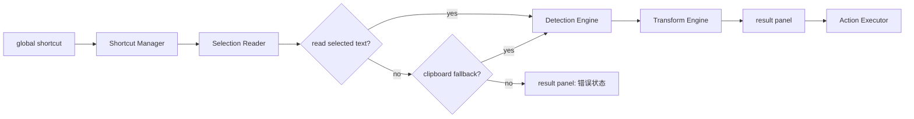

# Mac Text Actions 实现说明

本文档合并原来的技术架构文档，用于统一技术基线、模块边界、运行时数据流和实现约束。

## 1. 技术基线

- 开发语言：`Swift 6`
- UI 框架：`SwiftUI`
- 系统桥接：`AppKit`
- 架构模式：`MVVM + Services`
- 异步方式：优先 `async/await`

项目是单平台 macOS 工具，主要复杂度来自系统集成而不是 Web 视图渲染，因此不采用 `Tauri`、`Electron` 或其他 Web 容器路线，除非产品方向被明确修改。

## 2. 兼容性与权限

### 2.1 兼容性基线
- 最低支持系统：`macOS 13 Ventura`
- 推荐运行环境：`macOS 14+`
- 推荐开发环境：`Xcode 16+`
- 硬件目标：优先支持 `Apple Silicon`，可行时产出 `Universal` 应用包兼容 `Intel Mac`

### 2.2 系统权限与能力依赖
- 辅助功能相关能力：读取或替换 `selected text`
- 输入监听能力：监听 `global shortcut`
- 剪贴板读取能力：仅用于 `clipboard fallback`
- 提醒事项授权：创建提醒事项

权限状态必须显式可见，不能把失败伪装成无反馈。
首次启动时，若缺少 `辅助功能` 或 `输入监听`，应用应优先进入权限引导，待两项完成后再启动 `global shortcut` 链路。

### 2.3 macOS 13 重点验证项
- `global shortcut` 注册和触发稳定性
- 浮层窗口的显示层级、焦点切换和关闭行为
- `selected text` 读取链路
- `Replace Selection` 在不同前台应用下的回写行为
- `SwiftUI + AppKit` 桥接细节

## 3. 架构目标

- 将输入获取、识别、转换、动作执行和界面渲染解耦
- 让新增文本类型主要影响识别与转换层，而不破坏主流程
- 在保留平台适配空间的前提下，保持实现足够具体
- 把系统集成和业务规则从 `View` 中隔离出去

## 4. 核心模块

### 4.1 App Shell
负责应用生命周期、菜单栏入口、设置页、权限状态和模块装配。

### 4.2 Shortcut Manager
负责注册并监听 `global shortcut`，在用户触发时派发主流程事件。

### 4.3 Selection Reader
负责优先读取当前前台应用的 `selected text`，必要时执行 `clipboard fallback`，并返回内容来源或明确错误。

### 4.4 Detection Engine
负责根据 [product.md](./product.md) 中定义的固定优先级识别输入类型。

### 4.5 Transform Engine
负责生成 `primary result`、类型相关的 `secondary action` 输出，以及 option 型二次操作的切换结果。

### 4.6 Action Executor
负责执行副作用动作，包括 `Copy Result`、`Replace Selection`、`JSON Compress`、`MD5` 和 `Create Reminder`。
`Replace Selection` 必须优先复用读取 `selected text` 时捕获的原始辅助功能目标，不能在结果面板激活后重新依赖当前焦点推断写回位置。

### 4.7 Result Panel
负责渲染结果、错误、原文摘要和动作入口，并把用户操作回传给 `Action Executor`。
对于带 option 的二次操作，`result panel` 与独立工具窗口都应消费同一份转换上下文，而不是分别维护独立开关状态。
当结果不具备安全写回目标时，`result panel` 不应展示 `Replace Selection`，并在替换失败时保留结果与错误提示。

## 5. 平台职责与分层

### 5.1 平台职责
- `SwiftUI`：设置窗口、菜单栏配置视图、`result panel` 内容结构和状态渲染
- `AppKit`：`global shortcut`、窗口显示行为、焦点管理、选区读取、原文替换等系统桥接

### 5.2 推荐分层
- 表现层：`result panel`、设置窗口、菜单栏
- 应用层：触发编排、状态管理、错误映射
- 领域层：类型识别、结果转换、动作规则
- 基础设施层：快捷键注册、选区读取、提醒事项集成

### 5.3 架构约束
- `View` 只负责渲染和事件转发
- `ViewModel` 负责状态与动作编排
- `Service` 负责系统桥接、识别、转换和副作用
- 不在 `v1` 阶段引入更重的分层模式

## 6. 运行时数据流



## 7. 数据契约建议

### 7.1 SelectionPayload
```text
rawText: String
sourceApp: String?
capturedAt: Date
contentSource: selection | clipboardFallback
replaceTarget: optional platform-specific selection target
```

### 7.2 DetectionResult
```text
type: json | invalidJson | timestamp | dateString | plainText
normalizedInput: String
errorMessage: String?
```

### 7.3 TransformResult
```text
primaryOutput: String?
secondaryActions: [ActionType]
optionAction: OptionAction?
displayMode: code | text | error | actionsOnly
errorMessage: String?
```

### 7.4 OptionAction
```text
buttonTitle: String
nextContext: TransformContext
```

### 7.5 ActionType
```text
copyResult
replaceSelection
compressJson
generateMd5
createReminder
```

## 8. 依赖、测试与发布约束

### 8.1 依赖策略
- 优先使用系统框架：`SwiftUI`、`AppKit`、`Foundation`、`EventKit`
- 若全局快捷键实现成本过高，可引入单一、轻量、成熟的 Swift 库
- 避免引入与当前产品价值无直接关系的额外依赖
- 开始稳定编码后引入 `SwiftLint`

### 8.2 测试重点
- 识别逻辑可单元测试
- 转换逻辑可单元测试
- 错误状态映射可单元测试
- `macOS 13` 下重点验证全局快捷键、浮层窗口、选区读取和替换链路

### 8.3 发布约束
- 当前仓库仍以 `Swift Package` 为实现基础
- 在未补齐签名和公证链路前，发布产物默认为未签名 `.app` 压缩包
- 进入公开分发阶段前应补齐 `Developer ID` 签名、`Apple notarization` 和更完整的打包链路
