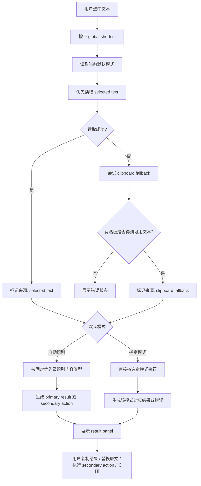
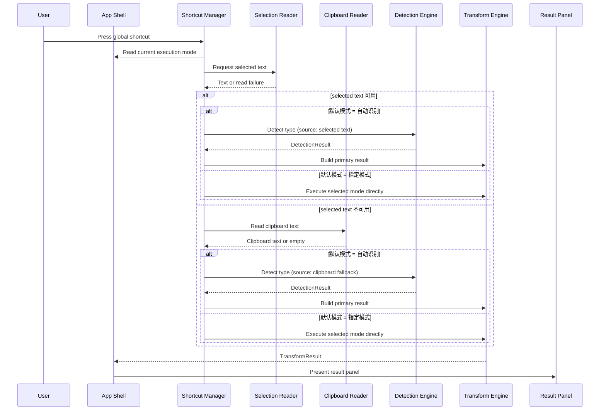
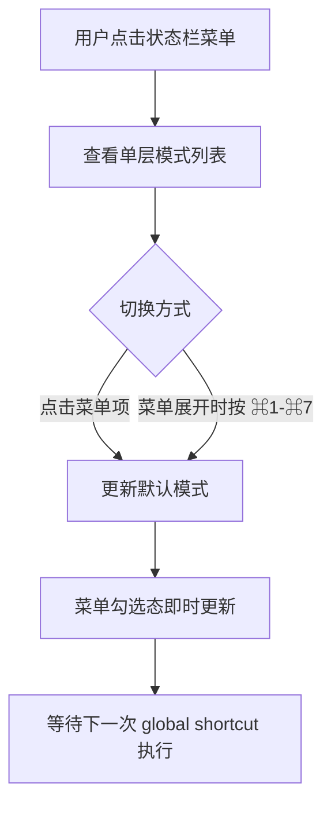
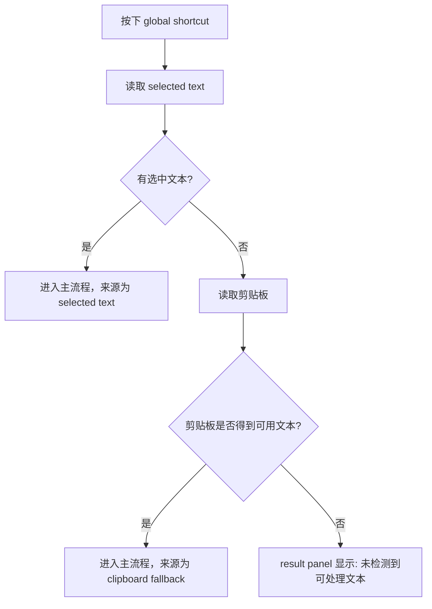
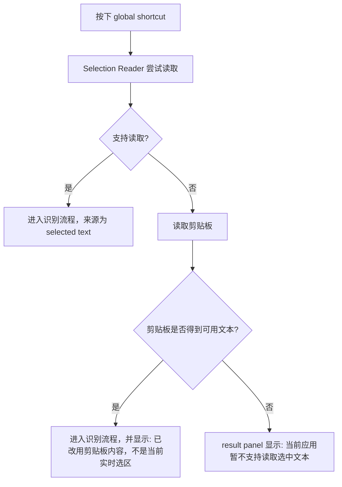
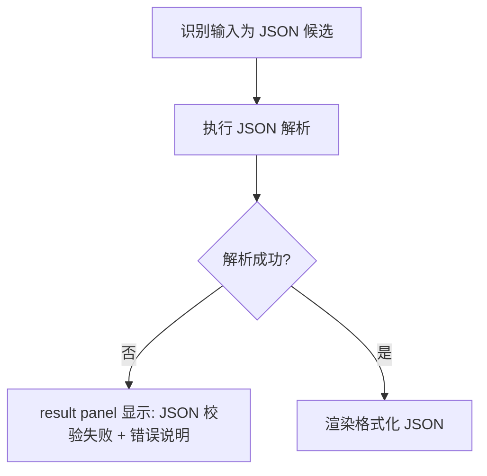
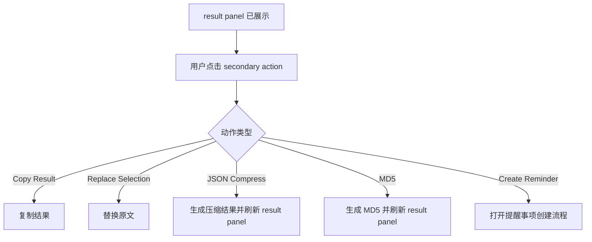

# Mac Text Actions 交互流程

## 1. 主流程

## 2. 快捷键到结果面板时序

## 3. 状态栏菜单切换流程

## 4. 无选中文本流程

## 5. 当前应用不支持选区读取

## 6. 非法 JSON 流程

## 7. 二级动作流程

## 8. 交互规则总结
- `global shortcut` 是唯一主入口
- 状态栏菜单负责选择当前默认模式
- 菜单展开时可用 `⌘1` 到 `⌘7` 切换默认模式，其中 `自动识别 = ⌘1`、`创建提醒事项 = ⌘2`、`JSON 格式化 = ⌘3`、`JSON Compress = ⌘4`、`时间戳转本地时间 = ⌘5`、`日期转时间戳 = ⌘6`、`MD5 = ⌘7`
- 菜单顺序中将低频的 `创建提醒事项` 固定放在最后，但不改变其 `⌘2` 快捷键映射
- 主流程优先读取 `selected text`
- 仅在读取失败时才允许 `clipboard fallback`
- 读取失败后允许自动触发一次 `clipboard fallback`
- 发生 `clipboard fallback` 时必须明确标注来源，且不能让用户误以为内容来自直接读取到的实时选区
- `自动识别` 只决定 `primary result`
- 指定模式执行时不回退到自动识别
- `secondary action` 由用户显式触发
- 无可用文本和读取失败必须明确提示
