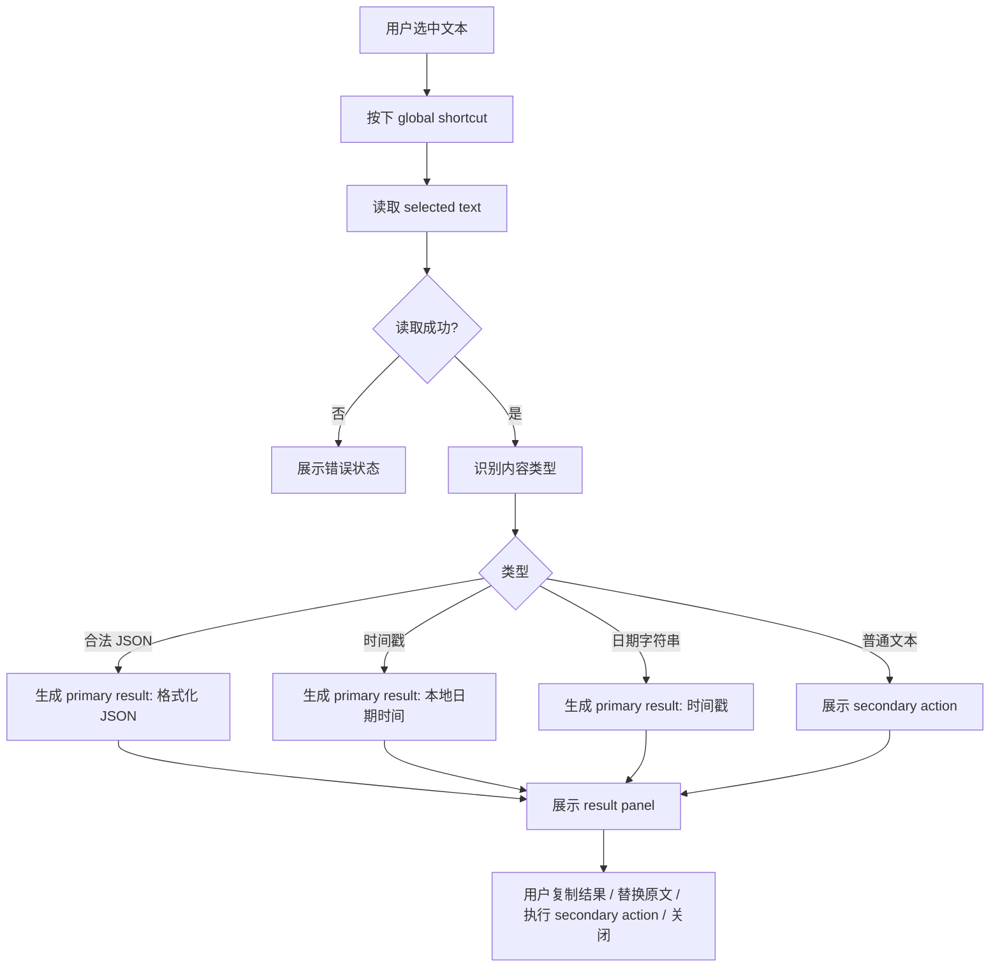
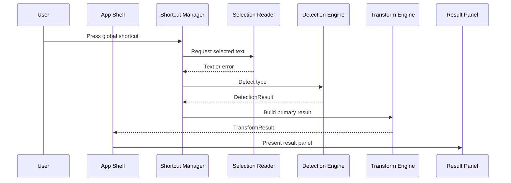
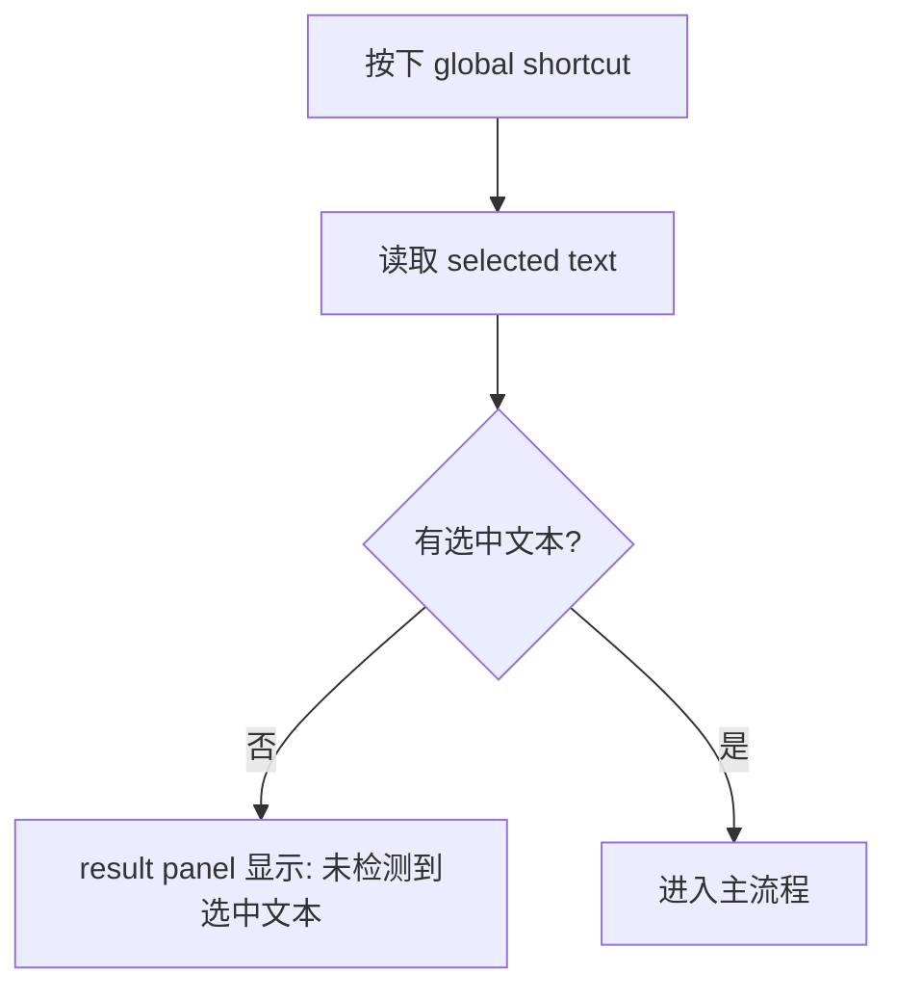
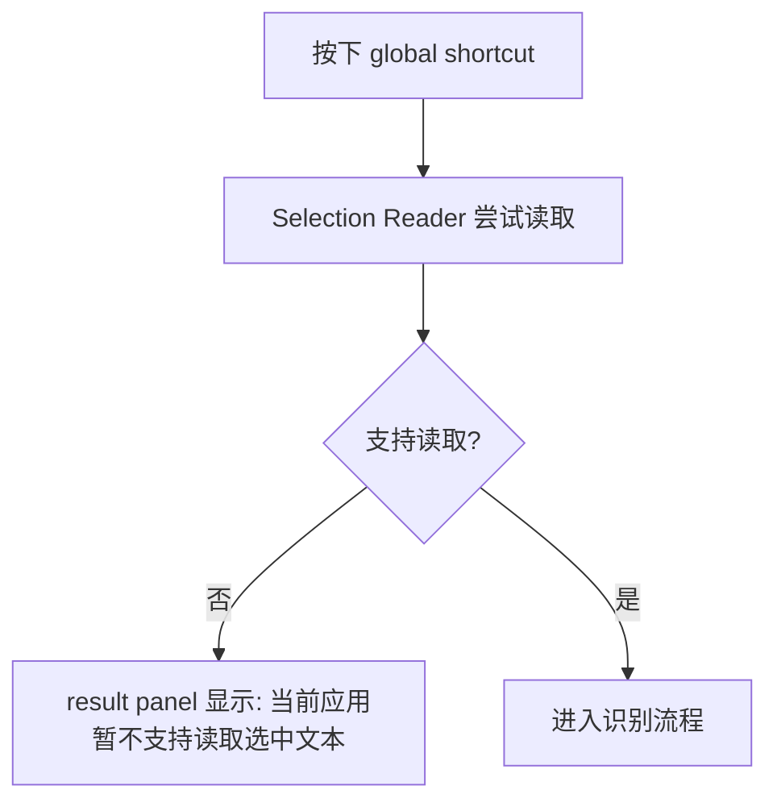
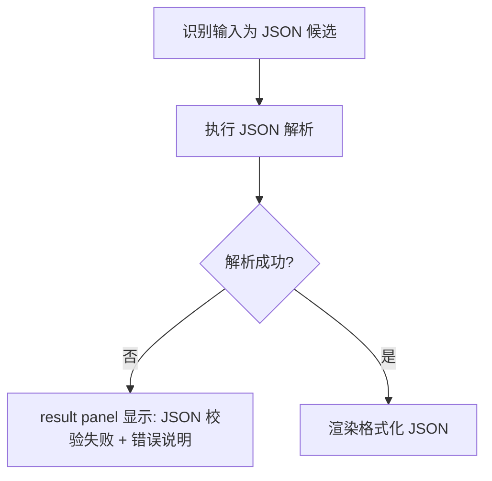
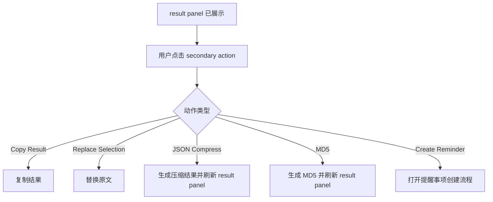

# Mac Text Actions 交互流程

## 1. 主流程

## 2. 快捷键到结果面板时序

## 3. 无选中文本流程

## 4. 当前应用不支持选区读取

## 5. 非法 JSON 流程

## 6. 二级动作流程

## 7. 交互规则总结
- `global shortcut` 是唯一主入口
- 自动识别只决定 `primary result`
- `secondary action` 由用户显式触发
- 无选中文本和读取失败必须明确提示
- 不做剪贴板回退
