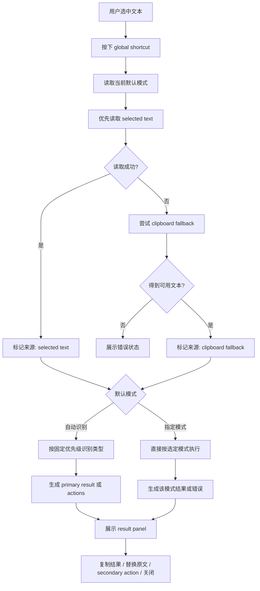

# Mac Text Actions 产品说明

本文档合并原来的需求、方案、设计和交互流程文档，作为产品行为的单一说明。

## 1. 产品定位

`Mac Text Actions` 旨在为 macOS 提供一个轻量、稳定、可预测的文本动作入口。用户在任意应用中选中一段文本后，通过 `global shortcut` 即可得到转换结果或后续动作，而不必切换到网页工具、命令行或多个独立应用。

目标是缩短高频文本处理路径，同时保留足够明确的反馈和控制边界：
- 对低歧义内容直接生成 `primary result`
- 对工具型能力保留显式 `secondary action`
- 对失败场景给出可解释反馈

## 2. v1 范围

### 2.1 包含内容
- `global shortcut` 触发主流程
- 优先读取当前 `selected text`
- 读取失败时允许 `clipboard fallback`
- `JSON` 格式化与合法性校验
- 时间戳转本地日期时间
- 日期字符串转时间戳
- 文本 `MD5`
- 快速创建 macOS 提醒事项
- 复制结果
- 替换原文

### 2.2 非目标
- 剪贴板管理
- 自动替换原文
- 批量处理
- 富文本处理
- 多动作编排
- 提醒事项自然语言时间解析

## 3. 方案结论

`v1` 采用“后台常驻 + `global shortcut` + 轻量 `result panel`”方案。

选择这条路线的原因：
- 最符合“选中即处理”的核心目标
- 自动行为只覆盖低歧义结果展示，不会静默写回
- 可以在同一结果面板中承载 `secondary action`
- 比纯菜单栏工具更短，比“自动执行并写回”更可控

状态栏菜单只承担轻量控制职责：
- 切换默认模式
- 展示模式切换快捷键
- 打开设置
- 退出应用

## 4. 主流程

## 5. 识别与执行规则

### 5.1 检测优先级

以下优先级是当前唯一权威定义，新文档应引用本节，不再重复定义：

1. 合法 `JSON`
2. `10` 位或 `13` 位纯数字时间戳
3. 可解析日期字符串
4. 普通文本

### 5.2 自动识别默认行为
- `JSON`：直接展示格式化结果
- `Timestamp`：直接展示本地日期时间
- `Date String`：直接展示时间戳
- `Plain Text`：不自动生成结果，只展示可执行动作

### 5.3 不自动执行的能力
以下能力统一作为 `secondary action` 暴露：
- `JSON Compress`
- `MD5`
- `Create Reminder`
- `Copy Result`
- `Replace Selection`

### 5.4 指定模式执行
状态栏菜单可将以下模式设为默认模式：
- `自动识别`
- `JSON 格式化`
- `JSON Compress`
- `时间戳转本地时间`
- `日期转时间戳`
- `MD5`
- `创建提醒事项`

当默认模式不是 `自动识别` 时，`global shortcut` 直接按指定模式执行，不再参与自动识别分流。

## 6. 结果面板

`result panel` 需要满足以下约束：
- 触发后立即给出反馈
- 自动识别后直接渲染结果，不强迫用户先选工具
- 不在用户未确认时改写原文
- 结果、来源和下一步动作都要可见

推荐区块如下：
- 顶部：执行来源，如 `自动识别 · JSON` 或 `指定模式 · MD5`
- 顶部辅助信息：原文摘要和内容来源
- 中部：`primary result` 或错误信息
- 底部：与当前类型相关的 `secondary action`

## 7. 错误与回退规则

- 无 `selected text` 且剪贴板也无可用文本：显示 `未检测到可处理文本`
- 当前应用不支持读取选区但剪贴板有可用文本：继续主流程，并显示 `已改用剪贴板内容`
- 当前应用不支持读取选区且剪贴板无可用文本：显示 `当前应用暂不支持读取选中文本`
- 非法 `JSON`：显示 `JSON 校验失败` 和错误说明，不降级为普通文本
- 日期无法解析：按普通文本处理，不额外展示错误
- 替换失败：保留当前结果，并提示改为复制

`clipboard fallback` 的保护规则如下：
- 仅在直接读取 `selected text` 失败后自动触发一次
- 若复制后剪贴板仍无可用文本，则视为回退失败
- UI 必须明确提示内容来自剪贴板回退，而不是实时选区

## 8. 成功标准与后续方向

### 8.1 成功标准
- 一次快捷键触发后即可看到结果或错误反馈
- `JSON`、时间戳、日期字符串在高频场景下稳定识别
- 失败场景没有静默无响应
- 主路径足够短，不强迫用户切换上下文

### 8.2 后续可扩展方向
- 新增更多文本类型
- 支持用户自定义默认动作
- 提供更丰富的结果渲染
