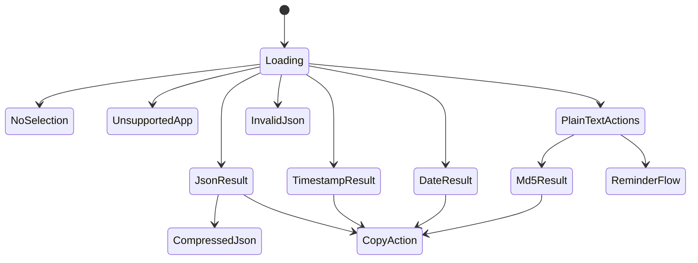

# Mac Text Actions UI 说明

本文档只保留 UI 本身需要长期维护的规则。产品行为以 [product.md](../product.md) 为准，技术边界以 [implementation.md](../implementation.md) 为准。

## 1. 设计方向

- 风格方向：`Native macOS utility panel + refined polish`
- 目标：轻量、克制、立即反馈，不抢占用户当前上下文
- 原则：`primary result` 是视觉中心，`secondary action` 靠近结果但不喧宾夺主
- 不采用网页工具台、重品牌工作台或命令列表优先的视觉模型

## 2. 视觉基调

- 主字体使用 `SF Pro`
- 结构化结果使用等宽字体
- 使用轻材质或半透明浮层背景，色彩以系统中性色为主
- 错误态使用低饱和状态色，不做大面积高对比警告块
- 动效只保留短促的显隐和状态切换
- `result panel` 显示采用窗帘展开动画，从上往下展开，使用 SwiftUI `mask` 和 spring 动画实现
- 应用图标与状态栏图标共享 `text cursor + sparkles` 的图形语义

## 3. 信息架构

- 常驻层：状态栏菜单、独立设置窗口
- 主交互层：`result panel`
- 补充工作区：独立工具窗口
- 系统动作层：复制、替换、提醒事项创建

## 4. 状态栏菜单

- 状态栏菜单采用单层模式列表，不做分组或二级子菜单
- 菜单项顺序固定为：`自动识别`、`MD5`、`JSON Compress`
- 当前默认模式使用勾选态表示
- 菜单项名称后显示 `⌘1` 到 `⌘3` 对应快捷键
- 快捷键映射固定为：`自动识别 = ⌘1`、`MD5 = ⌘2`、`JSON Compress = ⌘3`
- 快捷键顺序必须与菜单显示顺序一一对应，避免认知跳号
- 菜单内 `⌘1` 到 `⌘3` 只在菜单展开时生效，用于切换默认模式，不直接执行动作
- `创建提醒事项` 能力保留，但当前不出现在顶部菜单栏，也不占用菜单模式快捷键
- 顶部菜单只保留自动识别主路径与需要强制执行的模式，不重复暴露自动识别已稳定命中的能力
- 顶部应用菜单和状态栏菜单中的“设置...”都应打开同一个独立设置窗口

## 5. 设置窗口

- 首次启动时，若缺少 `辅助功能`，优先显示独立权限引导窗口；引导完成前不进入工具页或常规设置页
- 权限引导窗口采用双栏结构：
  - 左侧为步骤说明、权限卡片、状态标签与继续按钮
  - 右侧为权限用途与信任说明
- 辅助功能授权入口使用 `PermissionFlow` 组件，点击后自动打开系统设置并显示拖拽引导浮层
- 首启引导只覆盖 `辅助功能`
- 设置窗口独立打开，不与工具操作页混排
- 该窗口只承担“快捷键与权限”职责，不承载时间戳转换、JSON 或 MD5 等功能
- 主体保留一张“快捷键与权限”信息卡，集中展示：
  - 当前 `global shortcut`
  - 状态栏菜单内 `⌘1` 到 `⌘3` 的模式切换职责
  - 辅助功能相关权限状态
  - 提醒事项授权状态
  - 重新检查或引导入口
- 全局快捷键注册通过 `HotKey` 完成，设置页录制与配置展示继续由应用自身维护
- 快捷键支持录制和修改，并实时更新显示
- 若当前系统对仅含 `⌥ / ⇧` 的组合存在全局快捷键限制，设置页需要明确提示用户改为包含 `⌘` 或 `⌃` 的组合
- 权限提示需要明确说明失败原因，不能只给一个模糊的不可用状态

## 6. Result Panel

### 6.1 布局
- 顶部：执行来源、类型标签、原文摘要
- 顶部辅助信息：`selected text` 或 `clipboard fallback` 来源标签
- 中部：`primary result`、错误信息，或普通文本场景下的推荐提示
- 底部：复制、替换和类型相关 `secondary action`

### 6.2 Option 型二次操作
- 当某个功能存在可逆 option 时，统一放在底部动作栏，不在输入区使用 `Toggle`
- option 按钮始终显示“下一步动作”，点击后立即刷新当前结果，并把按钮文案翻转成相反动作
- `result panel` 与独立工具窗口必须使用相同文案和相同切换顺序
- 当前固定文案：
  - `MD5`：`转大写` / `转小写`
  - `日期转时间戳`：`转毫秒` / `转秒级`
- `时间戳转本地时间` 不单独提供秒级 / 毫秒级切换按钮，继续按输入位数自动识别

### 6.3 表现原则
- 面板宽度按内容长度采用固定档位，不做连续拉伸
- 时间结果保持紧凑，`JSON` 和较长文本允许更宽档位
- 头部区域保持紧凑，操作按钮偏小巧
- 内容区域优先给结果留空间，背景透明度偏低，维持轻盈感
- 所有复制入口统一显示底部居中的 `已复制` HUD，不再使用局部黑色 toast
- `result panel` 的复制按钮在显示复制反馈后再短暂延迟关闭，保证确认状态可见
- 结果文本双击复制与按钮复制共用同一套反馈节奏和文案
- `Replace Selection` 只在当前结果持有可安全写回的原始目标时显示；来源为 `clipboard fallback` 的结果不显示替换入口
- 当替换失败时，面板保留当前结果，并提示用户改用复制，而不是直接关闭

### 6.4 状态

## 7. 不同内容类型的 UI 行为

### 7.1 JSON
- 使用代码块风格展示格式化结果
- 默认主动作是 `Copy Result`
- 附加动作为 `JSON Compress` 和 `Replace Selection`

### 7.2 时间戳 / 日期字符串
- 使用高可读文本样式展示转换结果
- 可附带简短补充说明，如本地时间
- 默认主动作是 `Copy Result`
- `日期转时间戳` 需要在底部提供秒级 / 毫秒级切换按钮
- `时间戳转本地时间` 仅按输入位数自动识别，不额外提供切换按钮

### 7.3 普通文本
- 不自动生成 `primary result`
- 显示推荐提示后再展示可执行动作
- `MD5` 是最突出、默认优先的推荐动作
- 其他文本动作的视觉权重与顺序都低于 `MD5`
- `MD5` 结果需要在底部提供大小写切换按钮

### 7.4 错误状态
- 错误信息必须简洁且明确
- 不隐藏失败原因
- 发生 `clipboard fallback` 时，必须明确提示“不是当前实时选区”
- `clipboard fallback` 成功后应尽量恢复用户原有剪贴板；但若剪贴板已在此期间被后续复制更新，则不应为了恢复旧内容而覆盖新内容

## 8. 键盘行为

- `Esc`：关闭 `result panel`
- `global shortcut`：按当前默认模式执行主流程
- `⌘1` 到 `⌘3`：仅在状态栏菜单展开时切换默认模式
- `Cmd+Enter`：执行当前工具主动作
- `Cmd+Delete`：清空当前输入与结果
- `Cmd+C`：复制当前结果

## 9. 不推荐方向

- 不做网页应用风格面板
- 不做重彩色卡片式工具台
- 不做复杂多页签或深层侧边栏结构
- 不做以命令搜索为中心的主交互模型
