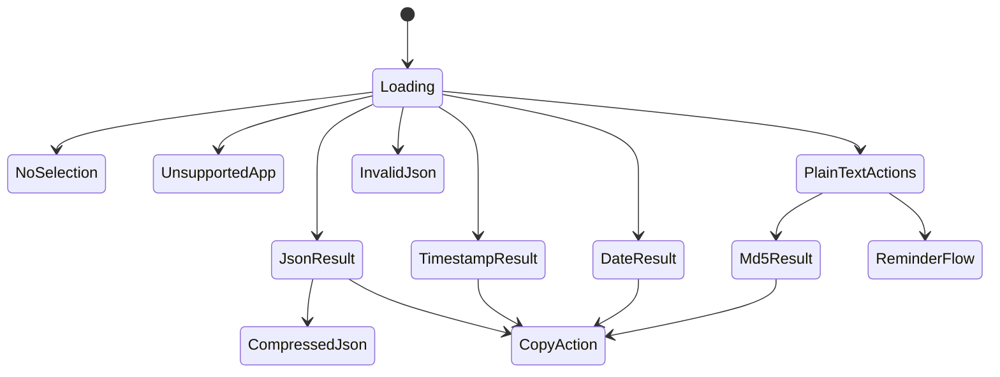
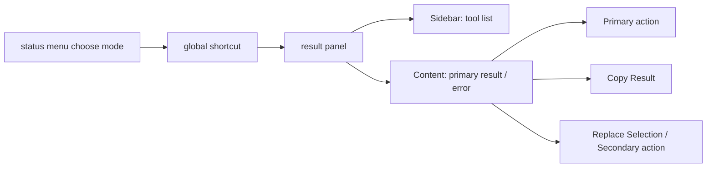

# Mac Text Actions UI 设计

## 1. 设计目标
- 具备 macOS 工具型应用的轻量感
- 触发后立即展示结果，不抢占主上下文
- 让 `primary result` 成为视觉中心
- 把 `secondary action` 收敛在结果周边，而不是堆成工具箱

## 2. UI 风格结论
- 风格方向：`Native macOS utility panel + refined polish`
- 核心策略：以原生系统感为底，在材质、圆角、层级、留白和动效上做克制精致化
- 不采用网页工具台、重品牌化工作台或命令列表优先的视觉模型

### 2.1 视觉原则
- 系统感优先于品牌表达
- 结果优先于装饰
- 信息层级清晰，但不依赖复杂色彩系统
- 只在状态反馈和类型标签上少量使用强调色

### 2.2 字体与排版
- 主字体使用 `SF Pro`
- `JSON` 和其他结构化结果使用等宽字体显示
- 时间结果使用更高权重或更大字号，突出最终值
- 保持短标题、清晰分区和较宽松的垂直间距

### 2.3 材质与色彩
- 使用轻材质或半透明浮层背景
- 主色调以中性灰和系统背景层级为主
- 错误态使用低饱和状态色，不做高对比大面积警告色块

### 2.4 动效原则
- 只保留短促的显隐和状态切换动画
- 动效用于强化反馈，不用于制造存在感
- 避免复杂弹跳、缩放链式动画或过度平滑过渡
- 弹框显示采用窗帘展开动画：从上往下展开，模拟卷起来的窗帘慢慢放下展开的效果，使用 SwiftUI 的 mask 和 spring 动画实现

### 2.5 图标语言
- 应用图标与状态栏图标共享同一语义核心：`text cursor + sparkles`
- 应用图标使用蓝色渐变圆角方块作为底，表达轻量但精致的工具属性
- 状态栏图标使用简化后的单色模板图，优先保证菜单栏中的识别度与系统协调性

## 3. 信息架构
- 常驻层：菜单栏、独立设置窗口
- 主交互层：`result panel`
- 功能工作区：独立工具窗口
- 系统动作层：复制、替换、提醒事项创建

### 3.1 状态栏菜单
- 状态栏菜单采用单层模式列表，不做分组或二级子菜单
- 菜单项依次展示：`自动识别`、`JSON 格式化`、`JSON Compress`、`时间戳转本地时间`、`日期转时间戳`、`MD5`、`创建提醒事项`
- 当前默认模式使用勾选态表示
- 菜单项名称后显示 `⌘1` 到 `⌘7` 对应快捷键，其中 `自动识别` 对应 `⌘1`，`创建提醒事项` 对应 `⌘2`，`JSON 格式化` 对应 `⌘3`，`JSON Compress` 对应 `⌘4`，`时间戳转本地时间` 对应 `⌘5`，`日期转时间戳` 对应 `⌘6`，`MD5` 对应 `⌘7`
- `创建提醒事项` 作为较低频模式固定放在菜单最后，但仍保留 `⌘2` 快捷键
- 菜单内快捷键仅在菜单展开时生效，用于切换默认模式，不直接执行

## 4. 工具页布局
### 4.1 Sidebar
- 顶部优先展示 `global shortcut` 状态摘要，明确 `Space` 是主入口
- 不保留单独品牌 `header`
- 直接展示工具列表，降低顶部装饰占比
- 当前工具信息保留在侧栏底部，作为轻量状态说明

### 4.2 Content
- 顶部展示当前工具标题、摘要和主动作按钮
- 主体区域由输入卡片与结果卡片组成
- 不再给整个右侧内容区额外套一层厚重外框，视觉重点落在内容卡片本身
- 默认隐藏整页滚动条的存在感，避免破坏原生工具面板的干净边缘
- `result panel` 宽度按内容类型和文本长度在固定范围内分段调整，不使用连续拉伸
- 时间戳等短结果保持紧凑宽度，长 `URL` 可放宽到更大的独立档位，`JSON` 放宽但上限低于超长 `URL`
- 弹框头部高度减少，更紧凑
- "复制"和"替换"按钮尺寸精简，更小巧
- 内容区域高度增加，显示更多文本
- 文本框背景透明度降低，更轻盈通透

### 4.3 Actions
- 主动作：执行当前工具转换
- 常用辅助动作：清空输入、复制结果
- 类型附加动作继续收敛在结果周边，而不是单独做一层 `header/footer`

### 4.4 快捷键设置
- 设置窗口支持录制和修改全局触发快捷键
- 默认快捷键为 `Space`，可在设置窗口中自定义
- 快捷键显示实时更新，支持组合键录制

## 5. 设置窗口布局
- 设置窗口独立打开，不与日期格式转换等功能页混排
- 顶部保留简洁标题说明，明确该窗口只承担设置职责
- 主体保留一张“快捷键与权限”信息卡，集中展示 `global shortcut`、状态栏菜单内的 `⌘1` 到 `⌘7` 模式切换、权限状态与重新检查入口
- 顶部应用菜单和状态栏菜单中的“设置...”统一打开该窗口

## 6. 结果面板状态

## 7. 线框级交互流

## 8. 不同类型下的 UI 行为
### 7.1 JSON
- `Content` 使用代码块风格展示格式化结果
- 默认主动作是 `Copy Result`
- 附加动作为 `JSON Compress` 与 `Replace Selection`

### 7.2 时间戳 / 日期字符串
- `Content` 使用高可读文本样式展示转换后的 `primary result`
- 可显示简短补充说明，如本地时间
- 默认主动作是 `Copy Result`

### 7.3 普通文本
- 不自动生成 `primary result`
- `Content` 展示可执行工具说明
- 底部展示 `MD5`、`Create Reminder`

### 7.4 错误状态
- 以明显但不过度抢眼的错误样式展示
- 保持说明简洁
- 不隐藏当前失败原因
- 当内容来自 `clipboard fallback` 时，需明确提示“不是当前实时选区”，避免用户把剪贴板旧内容误认为当前 `selected text`

## 9. 关键 UI 建议
- 面板宽度优先服务内容展示，不做超窄命令条
- 面板宽度采用固定档位：短内容紧凑，中长内容适度放宽，超长 `URL` 允许更宽展示
- `primary result` 区域是视觉中心，`secondary action` 保持次要但可达
- 避免在工具页顶部再叠加独立品牌 `header`
- 菜单栏和设置页保持朴素，避免与 `result panel` 争夺视觉重心

## 10. 键盘行为
- `Esc`：关闭 `result panel`
- `global shortcut`：在任意应用中对当前 `selected text` 按当前默认模式执行主流程
- `⌘1` 到 `⌘7`：仅在状态栏菜单展开时切换默认模式
- `Cmd+Enter`：执行当前工具主动作
- `Cmd+Delete`：清空当前输入与结果
- `Cmd+C`：复制当前结果

## 11. 不推荐方向
- 不做网页应用风格面板
- 不做重彩色卡片式工具台
- 不做复杂多页签或侧边栏结构
- 不做以命令搜索为中心的交互模型
