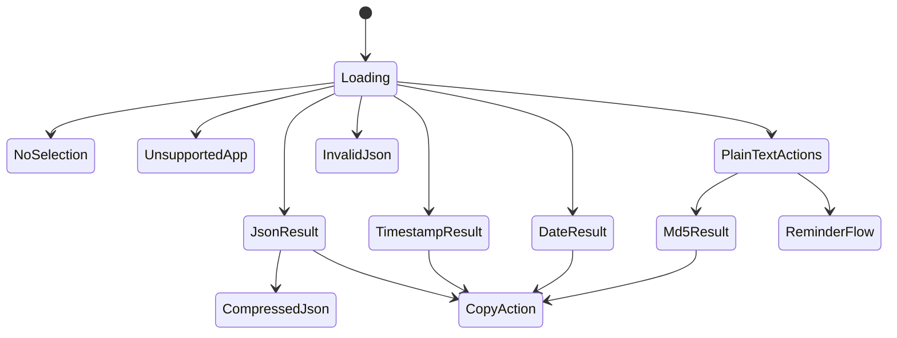
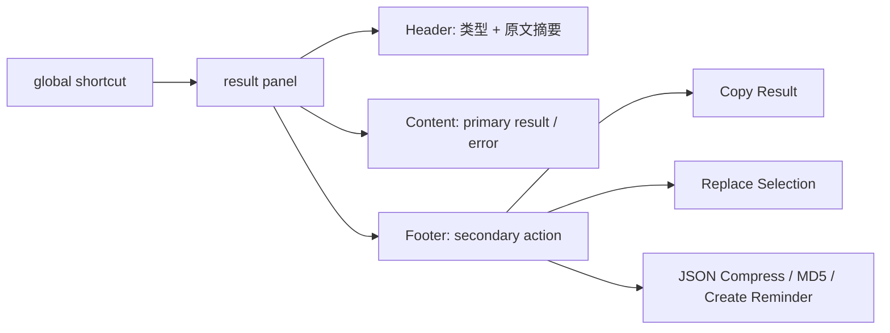

# Mac Text Actions UI 设计

## 1. 设计目标
- 具备 macOS 工具型应用的轻量感
- 触发后立即展示结果，不抢占主上下文
- 让 `primary result` 成为视觉中心
- 把 `secondary action` 收敛在结果周边，而不是堆成工具箱

## 2. UI 风格结论
- 风格方向：`Native macOS utility panel + refined polish`
- 核心策略：以原生系统感为底，在材质、圆角、层级、留白和动效上做克制精致化
- 不采用网页工具台、重品牌化工作台或命令列表优先的视觉模型

### 2.1 视觉原则
- 系统感优先于品牌表达
- 结果优先于装饰
- 信息层级清晰，但不依赖复杂色彩系统
- 只在状态反馈和类型标签上少量使用强调色

### 2.2 字体与排版
- 主字体使用 `SF Pro`
- `JSON` 和其他结构化结果使用等宽字体显示
- 时间结果使用更高权重或更大字号，突出最终值
- 保持短标题、清晰分区和较宽松的垂直间距

### 2.3 材质与色彩
- 使用轻材质或半透明浮层背景
- 主色调以中性灰和系统背景层级为主
- 错误态使用低饱和状态色，不做高对比大面积警告色块

### 2.4 动效原则
- 只保留短促的显隐和状态切换动画
- 动效用于强化反馈，不用于制造存在感
- 避免复杂弹跳、缩放链式动画或过度平滑过渡

## 3. 信息架构
- 常驻层：菜单栏与设置
- 主交互层：`result panel`
- 系统动作层：复制、替换、提醒事项创建

## 4. 结果面板布局
### 4.1 Header
- 类型标签：`JSON` / `Timestamp` / `Date` / `Text`
- 原文摘要：显示当前 `selected text` 的简短预览
- 关闭按钮

### 4.2 Content
- `primary result` 区域
- 错误状态区域
- 长文本滚动区域

### 4.3 Footer
- 主动作：`Copy Result`
- 次动作：`Replace Selection`
- 类型附加动作：`JSON Compress`、`MD5`、`Create Reminder`

## 5. 结果面板状态

## 6. 线框级交互流

## 7. 不同类型下的 UI 行为
### 7.1 JSON
- `Content` 使用代码块风格展示格式化结果
- 默认主动作是 `Copy Result`
- 附加动作为 `JSON Compress` 与 `Replace Selection`

### 7.2 时间戳 / 日期字符串
- `Content` 使用高可读文本样式展示转换后的 `primary result`
- 可显示简短补充说明，如本地时间
- 默认主动作是 `Copy Result`

### 7.3 普通文本
- 不自动生成 `primary result`
- `Content` 展示可执行工具说明
- 底部展示 `MD5`、`Create Reminder`

### 7.4 错误状态
- 以明显但不过度抢眼的错误样式展示
- 保持说明简洁
- 不隐藏当前失败原因

## 8. 关键 UI 建议
- 面板宽度优先服务内容展示，不做超窄命令条
- `primary result` 区域是视觉中心，`secondary action` 保持次要但可达
- Header 只保留必要信息，不堆叠过多状态说明
- 菜单栏和设置页保持朴素，避免与 `result panel` 争夺视觉重心

## 9. 键盘行为
- `Esc`：关闭 `result panel`
- `Enter`：执行当前聚焦动作
- `Tab`：在动作按钮间切换焦点

## 10. 不推荐方向
- 不做网页应用风格面板
- 不做重彩色卡片式工具台
- 不做复杂多页签或侧边栏结构
- 不做以命令搜索为中心的交互模型
